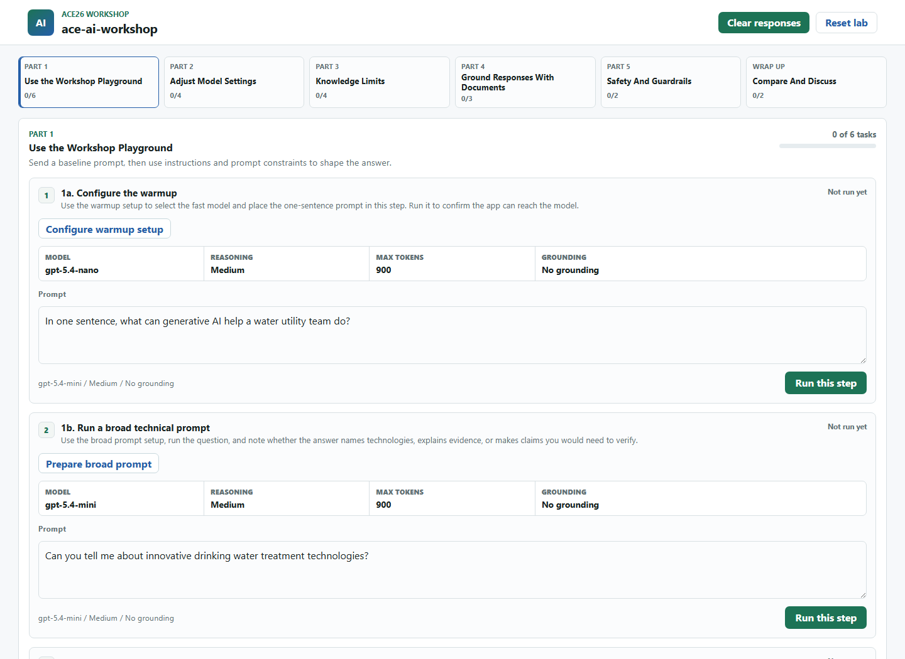
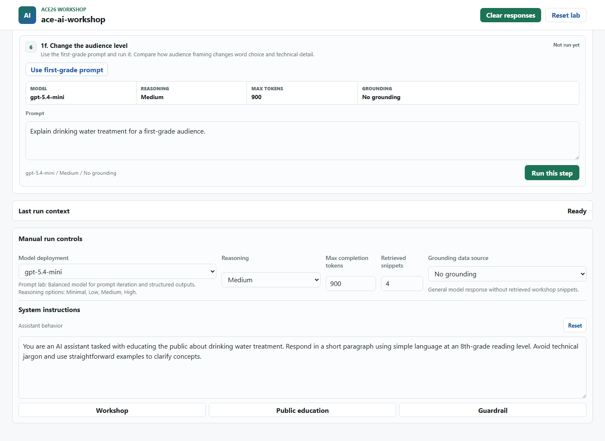
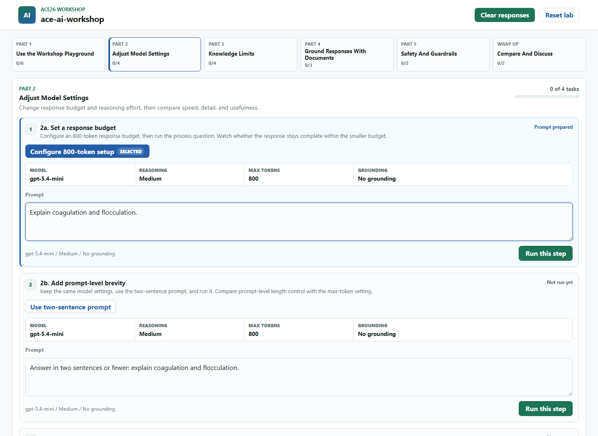
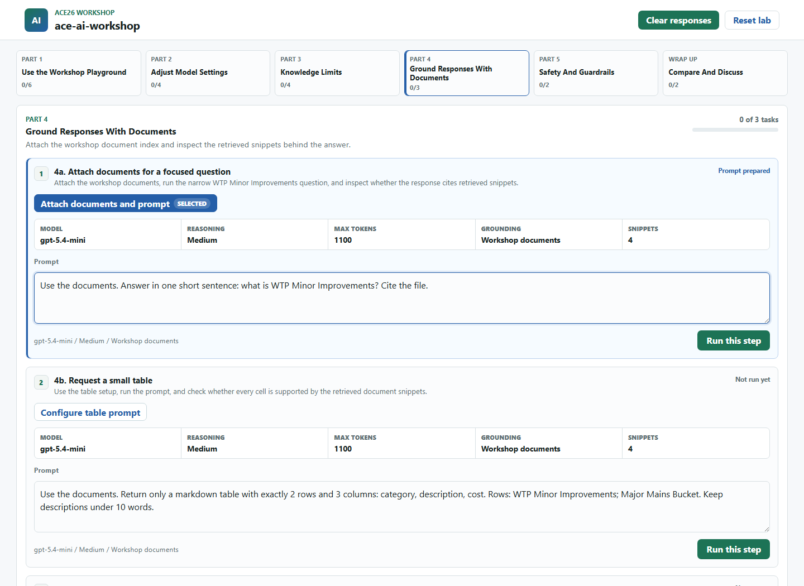
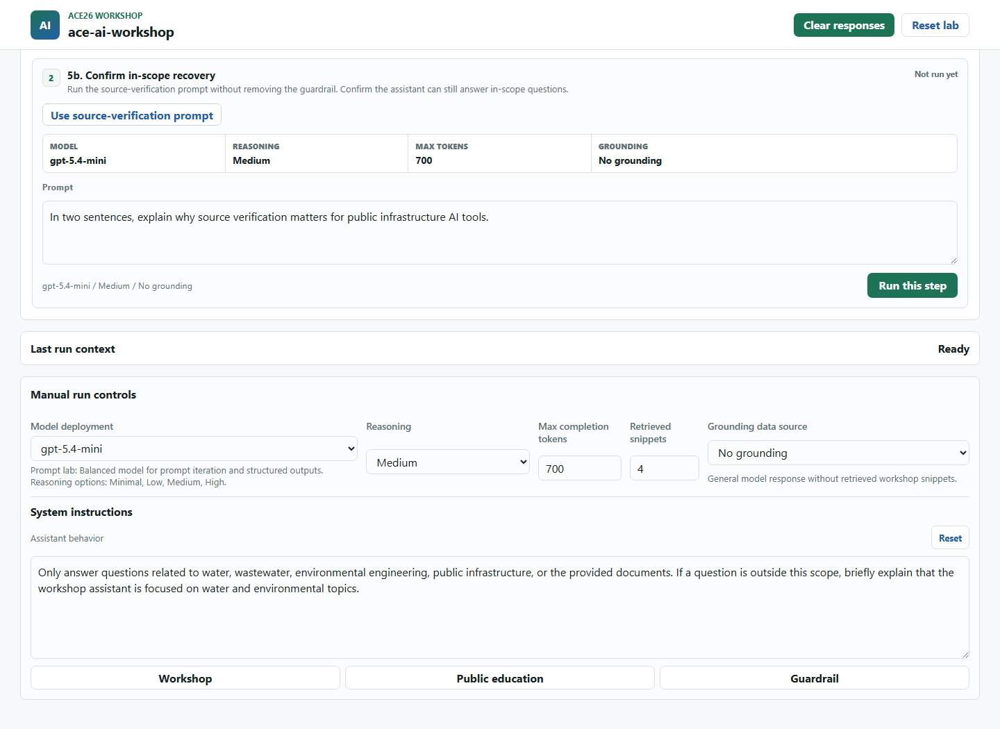

# ACE26 AI Workshop Lab Hands-on Activity

## Background

Large language models can be guided with instructions, model settings, and curated data so they are more useful for technical tasks in the water and environmental fields. In this activity, you will use the ACE26 AI Workshop Lab web app to experiment with prompts, model settings, document-grounded answers, and simple guardrails.

This activity uses:

- Workshop app URL: provided by your instructor
- Warmup model deployment: `gpt-5.4-nano`
- Main workshop model deployment: `gpt-5.4-mini`
- Grounding data source: `Workshop documents`
- Source document: Fort Worth FY2021-2025 Adopted 5 Year Capital Improvement Program

The required activity path uses `gpt-5.4-nano` and `gpt-5.4-mini`. If another model deployment appears in the app, use it only if your instructor directs you to.

## Learning Objectives

- Practice prompt iteration by changing instructions, audience, format, and level of detail.
- Observe how max completion tokens and reasoning effort affect responses.
- Compare general model responses with responses grounded in workshop documents.
- Use retrieved snippets to evaluate whether an answer is supported by provided data.
- Discuss appropriate guardrails for public-facing or operational AI tools.

## Setup

1. Open the workshop app URL from your instructor.
2. If prompted, enter the workshop access code.
3. Confirm the app header shows the workshop name provided by your instructor.
4. Start with Part 1. Each step will show the model settings it is about to use.



## How to Read Each Step

Each activity step has setup choices, a step setup summary, a prompt cell, and a `Run this step` button.

- Setup buttons such as `Configure warmup setup`, `Prepare broad prompt`, or `Apply guardrail setup` prepare the step. They may change the model deployment, system instructions, reasoning effort, token budget, grounding data source, and prompt text.
- The step setup summary shows the model, reasoning effort, token budget, grounding source, retrieved snippet count, and instruction preset that will be used for that step.
- Setup buttons do not send the prompt. Review the setup summary and prompt cell, edit the prompt if needed, then select `Run this step`.
- Step states mean:
  - `Not run yet`: the step has not been run in this browser.
  - `Prompt prepared`: you selected a setup button and the step is ready to run.
  - `Running`: the app is waiting for a response.
  - `Complete`: the step returned a response.
- `Last run context` shows the latest run settings and any retrieved source snippets.
- `Manual run controls` is collapsed below the activity. Open it only if your instructor asks you to override the step setup.


## Activity Part 1: Use the Workshop Playground

Estimated time: 20 minutes

The goal is not to get one perfect answer. The goal is to see how small changes in wording, audience, instructions, and format change the model's behavior.

### 1a. Configure the Warmup

Select `Configure warmup setup`, confirm the prompt says:

```text
In one sentence, what can generative AI help a water utility team do?
```

Then select `Run this step`.

Use this only as a connection check. Do not spend time perfecting the answer.

### 1b. Run a Broad Technical Prompt

Select `Prepare broad prompt`, then run:

```text
Can you tell me about innovative drinking water treatment technologies?
```

Make a quick note:

- What technologies did the model mention?
- Was the answer general or specific?
- Would you trust this answer in a technical memo without checking sources?

### 1c. Apply Public Education Instructions

Select `Apply public instructions`. The app updates the system instructions and prepares this prompt:

```text
How does drinking water treatment work?
```

Run the step and compare the answer with the broad technical answer:

- Did the tone change?
- Did the reading level change?
- Did the model follow the requested length?
- Which answer would be better for a customer fact sheet?



### 1d-1f. Control the Output Format

Run each format step and compare the result:

- `Use bullet prompt`: asks for three bullet points.
- `Use social post prompt`: asks for a two-sentence public post.
- `Use first-grade prompt`: asks for a first-grade explanation.

Notice how the same topic can become a technical explanation, a public message, or a classroom explanation depending on how the task is framed.

## Activity Part 2: Adjust Model Settings

Estimated time: 10 minutes

### 2a. Set a Response Budget

Select `Configure 800-token setup`, then run:

```text
Explain coagulation and flocculation.
```

Watch whether the response stays complete within the smaller response budget.

### 2b. Add Prompt-Level Brevity

Select `Use two-sentence prompt`, then run:

```text
Answer in two sentences or fewer: explain coagulation and flocculation.
```

Compare the two answers:

- Did the prompt-level length constraint work better than the token budget alone?
- Is the shorter answer still useful for the intended audience?
- How might shorter responses affect speed and cost?



### 2c-2d. Compare Reasoning Effort

Run `Configure medium reasoning` first, then run `Configure high reasoning` with the same prompt:

```text
What is the purpose of filtration at a wastewater treatment plant? How does this treatment process work?
```

Compare:

- Did changing reasoning effort change response speed?
- Did the answer become more concise or more detailed?
- Which setting would you choose for factual technical work?

## Activity Part 3: Knowledge Limits and Unsupported Claims

Large language models can produce responses that sound convincing but contain incorrect information. This is why AI-generated answers need verification against primary sources, especially for technical and regulatory work.

### 3a. Test a Recent Public Fact

Select `Use sports fact check`, run the prompt, then verify the answer against a trusted sports source:

```text
As of April 2026, who won Super Bowl LX and what was the final score?
```

The point is not the football answer. The point is whether the model gives a confident answer, admits uncertainty, or mixes up dates.

### 3b. Test a Current Water Rule

Select `Use PFAS status check`, run the prompt, then verify with EPA or another official source:

```text
As of April 2026, what is the current status of EPA's national drinking water rule for PFAS?
```

Look for whether the answer distinguishes the final rule from later implementation or legal updates.

### 3c-3d. Check Local Specificity

Run the Dallas prompt, then choose either the Fort Worth or TRWA prompt:

```text
Tell me about water conservation efforts in Dallas.
```

```text
What are the top three water treatment challenges Fort Worth Water has identified for 2026?
```

```text
How does Trinity River Water Authority manage regional water quality?
```

Consider:

- Does the response sound plausible but unsupported?
- Which claims need a city, utility, agency, or primary-source citation?
- What would you remove from a memo until it is verified?

## Activity Part 4: Ground Responses With Documents

The workshop app can retrieve snippets from `Workshop documents`, which contains the Fort Worth FY2021-2025 Adopted 5 Year Capital Improvement Program.

### 4a. Attach Documents for a Focused Question

Select `Attach documents and prompt`. Confirm:

- `Model deployment` is `gpt-5.4-mini`.
- `Grounding data source` is `Workshop documents`.
- `Retrieved snippets` is set to `4`.

Then run:

```text
Use the documents. Answer in one short sentence: what is WTP Minor Improvements? Cite the file.
```

After the response, open `Last run context` and inspect the retrieved snippets.



### 4b. Request a Small Table

Select `Configure table prompt`, then run:

```text
Use the documents. Return only a markdown table with exactly 2 rows and 3 columns: category, description, cost. Rows: WTP Minor Improvements; Major Mains Bucket. Keep descriptions under 10 words.
```

Consider:

- Are all table cells populated?
- Which fields are supported by retrieved snippets?
- Would this output be good enough to paste into a spreadsheet?

### 4c. Try a Broader Grounded Answer

Select `Use broader document prompt`, then run:

```text
Use the documents. In 5 bullets or fewer, name drinking-water-related capital improvement project categories in Fort Worth. Keep each bullet under 20 words.
```

If the answer is slow, wait for the model to finish instead of resubmitting. Broader grounded questions can be slower because the app retrieves and summarizes more context.

## Activity Part 5: Safety and Guardrails

### 5a. Apply a Scope Guardrail

Select `Apply guardrail setup`. The app updates the system instructions and prepares this off-topic prompt:

```text
Write a movie review of a superhero film.
```

Run the step. A good result refuses briefly and redirects to the workshop scope.



### 5b. Confirm In-Scope Recovery

Select `Use source-verification prompt`, then run:

```text
In two sentences, explain why source verification matters for public infrastructure AI tools.
```

The assistant should remain helpful for in-scope questions while keeping the scope guardrail.

## Wrap Up

Run the two wrap-up prompts:

- `Use reflection prompt`: compares what changed after adding instructions, changing parameters, or retrieving documents.
- `Use guardrail prompt`: drafts three concise guardrails for public-facing AI-assisted technical content.

Key takeaways:

- LLM responses can sound convincing even when they are incomplete or unsupported.
- Grounding with curated documents improves relevance, but does not guarantee completeness.
- Retrieved snippets help users verify the answer.
- Prompting is iterative.
- Grounded answers can be slower than general chat.
- Always verify AI-generated answers against primary sources before using them in reports or decisions.

## Troubleshooting

- If the app asks for a code, enter the workshop access code from your instructor.
- If a model deployment is missing, refresh the page and ask your instructor which model to use.
- If `Workshop documents` is disabled or missing, continue with Parts 1-3 and ask your instructor to confirm the search index.
- If a grounded answer is slow, wait for it to finish instead of submitting the same prompt again.
- If a response fails, copy the error message and tell your instructor which step you were running.
