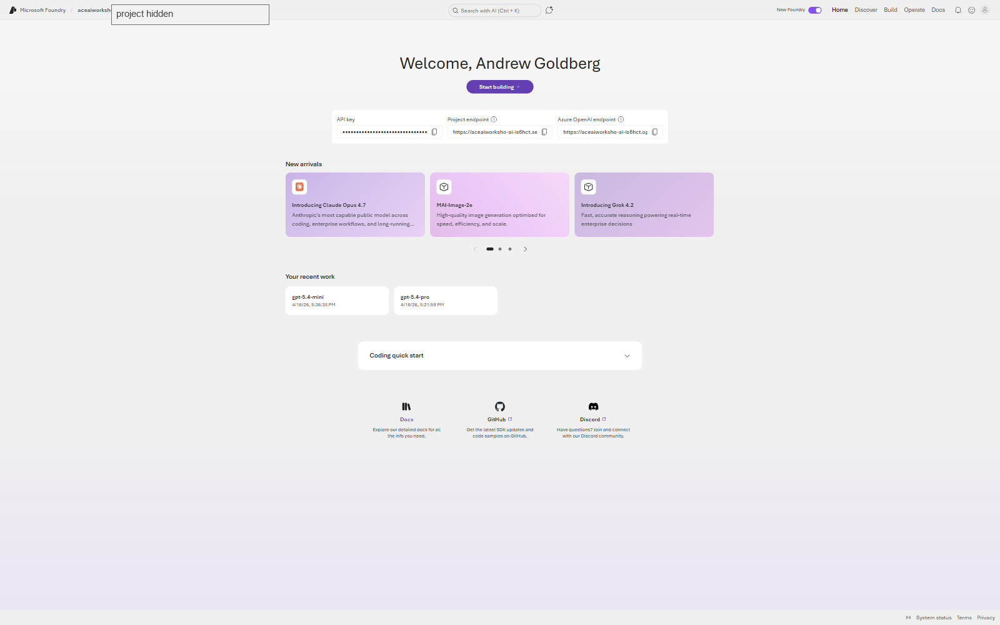
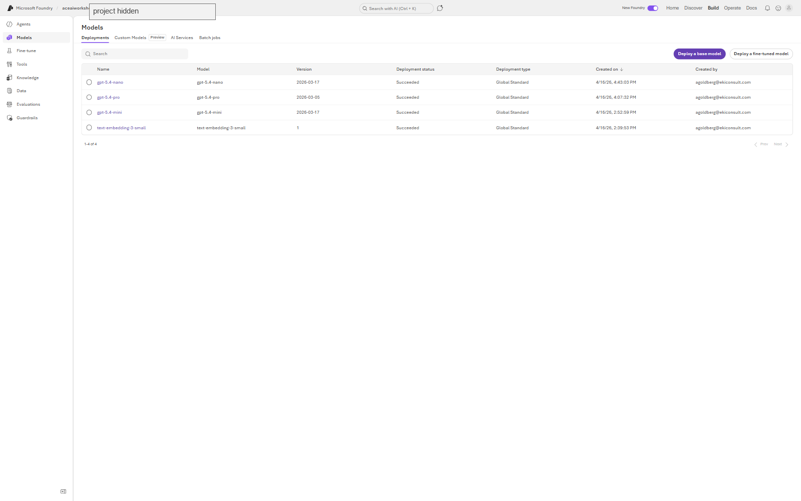
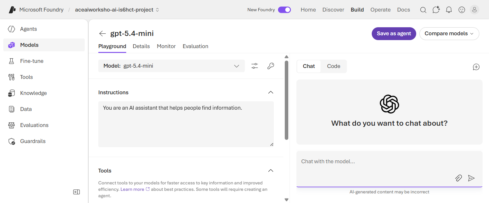
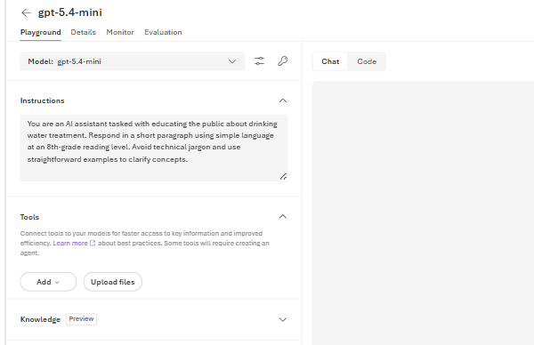
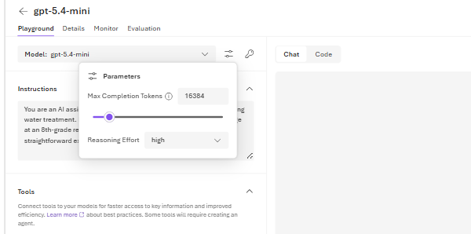
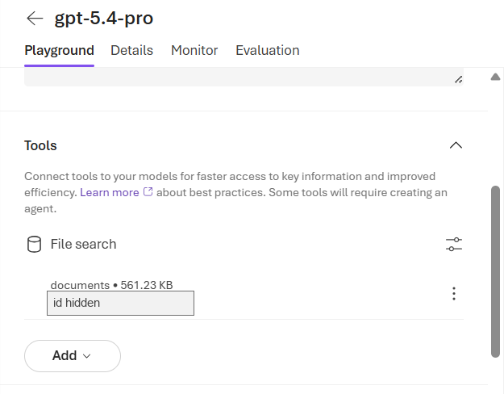
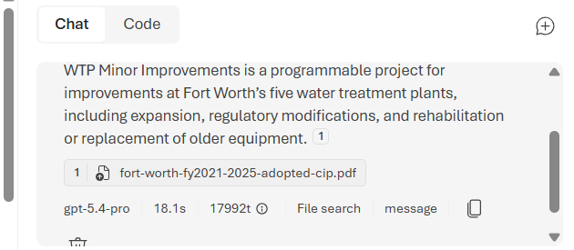
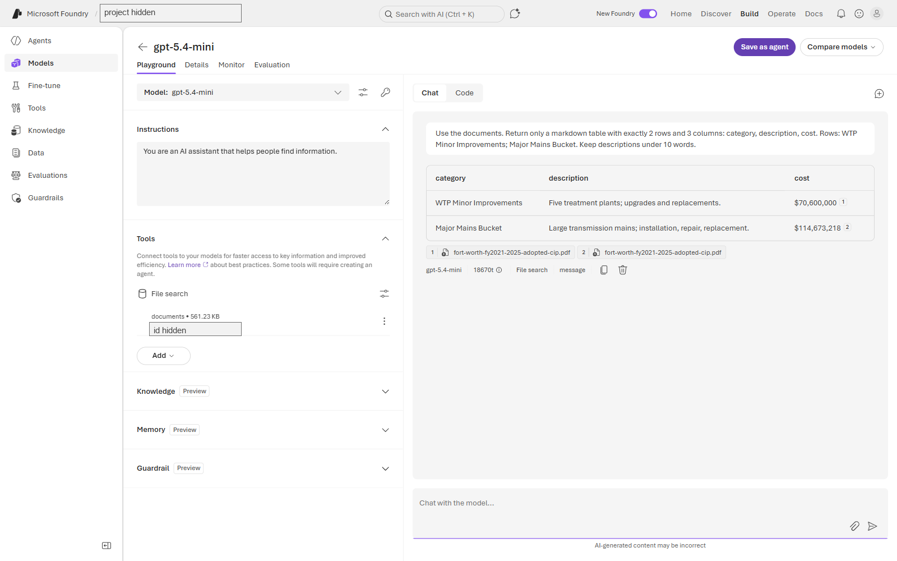
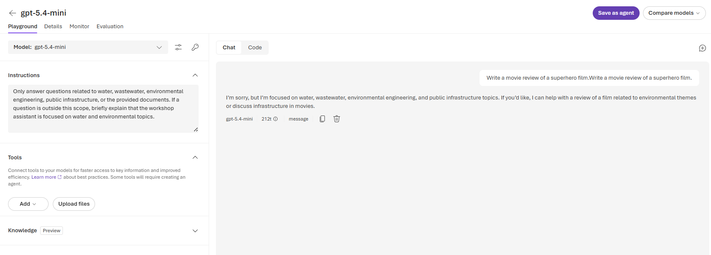

# ACE Pre-Conference AI Workshop Hands-on Activity

Microsoft Foundry guide

## Background

Large language models can be guided with instructions, parameters, and curated data so they are more useful for technical tasks in the water and environmental fields. In this activity, you will use the Microsoft Foundry model playground to experiment with prompts, model settings, and file search over a Fort Worth Capital Improvement Program document.

This activity uses:

- Microsoft Foundry project: provided by your instructor
- Model deployment for warmup: `gpt-5.4-nano`
- Model deployment for prompt exercises: `gpt-5.4-mini`
- Model deployment for document-grounded exercises: `gpt-5.4-pro`
- File search vector store: `documents`
- Source document: Fort Worth FY2021-2025 Adopted 5 Year Capital Improvement Program

A deployment is a hosted model that you can open and chat with in the playground.

## Learning Objectives

- Interact with a large language model in Microsoft Foundry.
- Practice prompt iteration by changing instructions, output format, and level of detail.
- Observe how model parameters affect response length and reasoning behavior.
- Compare general model responses with responses grounded in workshop documents.
- Use citations and source snippets to evaluate whether an answer is supported by the provided data.
- Discuss appropriate guardrails for public-facing or operational AI tools.

## Prerequisites and Setup

1. Go to Microsoft Foundry:

   `https://ai.azure.com`

2. Sign in with the account provided for the workshop.

3. If prompted, choose the workshop tenant or directory.

4. Open the workshop project. Your instructor will provide the project name.

5. In the top navigation, make sure the `New Foundry` toggle is on.

6. In the top navigation, select `Build`, then in the left navigation select `Models`.

7. Open the model deployment named `gpt-5.4-nano` for a quick warmup, then switch to `gpt-5.4-mini` for the main exercises.

   You will use `gpt-5.4-pro` later when you add the workshop document.





## Activity Part 1: Use the Model Playground

Estimated time: 20 minutes

In this part, you will use the Microsoft Foundry model playground to send prompts, inspect responses, and change the model instructions. The goal is not to get one perfect answer. The goal is to see how small changes in wording and context change the model's behavior.

### 1. Quick Warmup

Open `gpt-5.4-nano`, select the `Playground` tab, and ask:

```text
In one sentence, what can generative AI help a water utility team do?
```

This first prompt lets everyone confirm they can reach the playground before moving into the main exercises.

### 2. Open the Main Playground

From the workshop project:

1. Confirm `New Foundry` is turned on.
2. Select `Build`.
3. Select `Models`.
4. On the `Deployments` tab, open `gpt-5.4-mini`.
5. Select the `Playground` tab.

The playground has two main working areas:

- Setup panel: choose the model, write instructions, add tools, and adjust settings.
- Chat panel: send prompts, read responses, and continue the conversation.



### 3. Send a General Prompt

In the chat box, ask:

```text
Can you tell me about innovative drinking water treatment technologies?
```

Read the response and make one quick note:

- What technologies did the model mention?
- Was the answer general or specific?
- Would you trust this answer in a technical memo without checking sources?

What is happening: your prompt is sent to a cloud-hosted model deployment. The model generates a response based on patterns in its training data and the instructions you provide in the playground.

Broad prompts often produce broad answers. Later prompts will show how to control length, audience, and format.

### 4. Try a Public Education Task

Imagine your team is drafting a short public-facing fact sheet for water utility customers.

Ask:

```text
How does drinking water treatment work?
```

Before changing anything, observe the answer:

- Is it too long, too short, or about right?
- Is the language accessible to the public?
- Does the response include technical terms that may need explanation?

### 5. Add Instructions

In the `Instructions` field, replace the default text with:

```text
You are an AI assistant tasked with educating the public about drinking water treatment. Respond in a short paragraph using simple language at an 8th-grade reading level. Avoid technical jargon and use straightforward examples to clarify concepts.
```

The New Foundry playground may update the instructions without showing a separate `Apply` button. To make the comparison easier, select `New chat` after changing the instructions.

Ask the same question again:

```text
How does drinking water treatment work?
```

Compare the two answers:

- Did the tone change?
- Did the reading level change?
- Did the model follow the requested length?
- Which answer would be better for a customer fact sheet?



### 6. Refine the Output Format

Keep the same instructions and ask:

```text
Explain drinking water treatment in three bullet points.
```

Then ask:

```text
Write a two-sentence social media post about why drinking water treatment matters.
```

Finally, ask:

```text
Explain drinking water treatment for a first-grade audience.
```

Notice how the same topic can become a technical explanation, a public message, or a classroom explanation depending on how the task is framed.

### 7. Optional: Generate a Stronger System Prompt

If the playground includes a `Generate system prompt` or similar option, try it:

1. Describe the task: public education about drinking water treatment.
2. Ask the playground to generate instructions.
3. Apply the generated instructions.
4. Ask the drinking water treatment question again.

Consider whether the generated instructions are clearer than the instructions you wrote manually. Good instructions often include audience, tone, format, scope, and constraints.

### Part 1 Reflection

Discuss with a neighbor or write a short note:

- What changed the answer more: the user prompt or the model instructions?
- What instruction would you add if this assistant were used by your organization?
- What would need to be verified before publishing the answer externally?

## Activity Part 2: Adjust Model Parameters

Estimated time: 10 minutes

### Open Parameters

In the playground setup panel, select the sliders icon next to the model selector.

In the GPT-5.4 playground, the visible parameters are:

- `Max Completion Tokens`: the maximum response budget.
- `Reasoning Effort`: how much reasoning work the model should use before answering.



### Adjust Response Length

Set `Max Completion Tokens` to a lower value such as `800`, then ask:

```text
Explain coagulation and flocculation.
```

Then try a shorter user prompt:

```text
Answer in two sentences or fewer: explain coagulation and flocculation.
```

Consider:

- Is the answer still complete?
- Is it too short for the audience?
- How does response length affect speed and cost?

### Adjust Reasoning Effort

Open `Reasoning Effort` and compare the available choices. For these workshop exercises, use `medium`. If the playground rejects a reasoning setting, return to `medium` and continue.

Ask:

```text
What is the purpose of filtration at a wastewater treatment plant? How does this treatment process work?
```

Then change Reasoning Effort to `high` and ask the same question.

Consider:

- Does changing the reasoning setting change response speed?
- Does the answer become more concise or more detailed?
- Which setting would you choose for factual technical work?

## Activity Part 3: Knowledge Limits and Unsupported Claims

Large language models can produce responses that sound convincing but contain incorrect information. In the AI field, these are called "hallucinations." The model is not intentionally misleading you - it is generating text based on patterns, and sometimes those patterns lead to plausible-sounding but unsupported claims. This is why verifying AI-generated answers against primary sources is essential, especially for technical and regulatory work.

### Recent Public Facts

Ask a recent public-fact question:

```text
As of April 2026, who won Super Bowl LX and what was the final score?
```

Then check a trusted news or sports source. The point is not the football answer. The point is to see whether the model gives a confident answer, admits uncertainty, or mixes up years, teams, or scores.

Now try a water-sector example:

```text
As of April 2026, what is the current status of EPA's national drinking water rule for PFAS?
```

After the answer, check EPA's PFAS implementation page or another official source.

Consider:

- Does the model answer confidently?
- Does it give a date or source for the claim?
- Does it confuse the original final rule with later implementation updates?
- What would you cite if this were going into a technical memo?

### Organization-Specific Questions

Ask one or more of these:

```text
Tell me about water conservation efforts in Dallas.
```

```text
What are the top three water treatment challenges Fort Worth Water has identified for 2026?
```

```text
How does Trinity River Water Authority manage regional water quality?
```

Consider:

- Does the model provide specific, local information?
- Does the answer sound plausible but unsupported?
- What would you need to verify before using the response?

## Activity Part 4: Ground Responses with File Search

The workshop project includes a vector store named:

```text
documents
```

This vector store contains the Fort Worth FY2021-2025 Adopted 5 Year Capital Improvement Program.

### Add File Search

For this section, open the `gpt-5.4-pro` deployment.

Keep `Reasoning Effort` set to `medium` for the grounded exercises unless your instructor says otherwise.

In the setup panel (the left side of the playground - scroll down if you do not see `Tools`):

1. Find `Tools`.
2. Select `Add`.
3. Select `File search`.
4. In the `Attach files` dialog, choose the existing vector index:

   `documents`

5. Select `Attach`.
6. Confirm the left panel shows `File search`, `documents`, and the vector store ID.



> Note: The old guide referred to `Add your data`. In the New Foundry model playground, this is now presented as the `File search` tool.

### Keep Grounded Questions Small

File search works best when the question is specific and the requested output is clear. Start with a focused question:

```text
Use the documents. Answer in one short sentence: what is WTP Minor Improvements? Cite the file.
```

Then try a structured output:

```text
Use the documents. Return only a markdown table with exactly 2 rows and 3 columns: category, description, cost. Rows: WTP Minor Improvements; Major Mains Bucket. Keep descriptions under 10 words.
```

Avoid starting with broad prompts like:

```text
Can you tell me what capital improvement projects are planned in Fort Worth related to drinking water?
```

That question works, but it can take several minutes because the model may retrieve and summarize many parts of the CIP.

### Ask a Grounded Question

With file search attached to `gpt-5.4-pro`, ask:

```text
Use the documents. Answer in one short sentence: what is WTP Minor Improvements? Cite the file.
```

The response should reference the Fort Worth CIP PDF and show `File search` under the answer.



Consider:

- Does the grounded answer refer to the Fort Worth CIP?
- Are references shown?
- Are the references relevant to the answer?
- Is the answer slower than the ungrounded answer?

### Create a Structured Output

**Switch to the `gpt-5.4-mini` deployment for this exercise.** The smaller model handles structured table output more reliably in the playground. Attach the same `documents` file search vector store.

Ask:

```text
Use the documents. Return only a markdown table with exactly 2 rows and 3 columns: category, description, cost. Rows: WTP Minor Improvements; Major Mains Bucket. Keep descriptions under 10 words.
```



Optional broader prompt:

```text
Use the documents. In 5 bullets or fewer, name drinking-water-related capital improvement project categories in Fort Worth. Keep each bullet under 20 words.
```

If the answer is slow, wait for the model to finish rather than resubmitting.

Avoid broad table prompts like:

```text
Use the documents. Create a small table with 4 rows. Columns: project category, description, cost, and source note. Focus on drinking water.
```

Consider:

- Are all table cells populated?
- Which fields are supported by the cited document?
- Does the model include information that may need verification?
- Would this output be good enough to paste into a spreadsheet?

## Activity Part 5: Safety and Guardrails

In `gpt-5.4-mini`, add or update the instructions:

```text
Only answer questions related to water, wastewater, environmental engineering, public infrastructure, or the provided documents. If a question is outside this scope, briefly explain that the workshop assistant is focused on water and environmental topics.
```

Select `New chat`, then ask an off-topic question:

```text
Write a movie review of a superhero film.
```

Consider:

- Did the model follow the scope restriction?
- Would stronger guardrails be needed for a public-facing tool?
- What additional policies would apply to operational or critical infrastructure use cases?



## Wrap Up

In this activity, you configured a model to:

- Respond with different styles and formats.
- Adjust behavior through instructions and parameters.
- Use file search to ground answers in a workshop document.
- Return structured outputs such as tables.
- Apply simple scope guardrails.

Key takeaways:

- LLM responses can sound convincing even when they are incomplete or unsupported.
- Grounding with curated documents improves relevance, but does not guarantee completeness.
- Citations and references help users verify the answer.
- Prompting is iterative.
- File search adds retrieval steps, so grounded answers can be slower than general chat.
- Always verify AI-generated answers against primary sources before using them in reports or decisions.

## Troubleshooting

- If you cannot find the workshop project, confirm you are signed in to the correct tenant or directory.
- If you do not see `Tools` or `File search`, scroll down in the left setup panel and confirm `New Foundry` is turned on.
- If a grounded answer is slow, wait for it to finish instead of submitting the same prompt again.
- If a model deployment is missing, refresh `Build > Models > Deployments` and ask your instructor to confirm the project.
